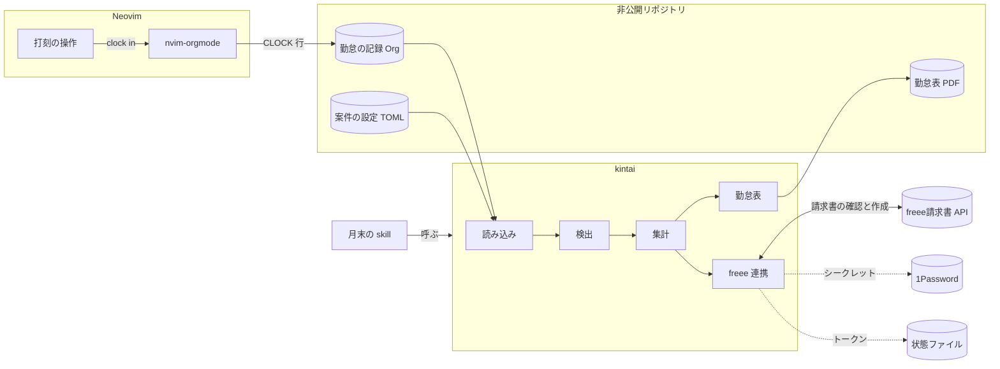
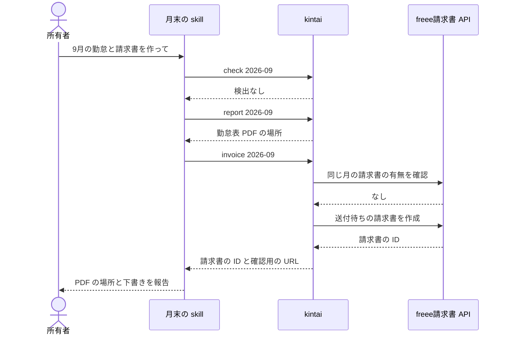
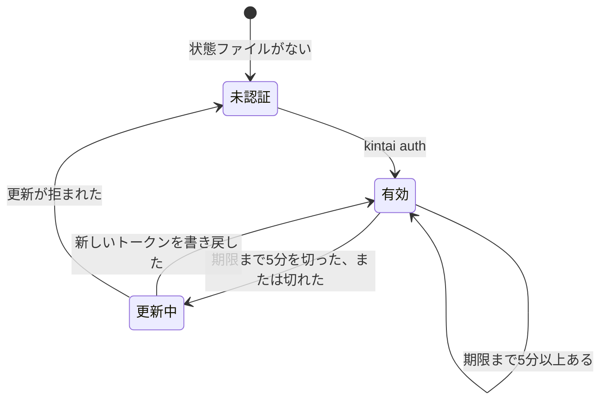

# 設計書: 勤怠表と請求書の作成

PRD 0007「勤怠表と請求書の作成」の要求を満たすために、ADR 0007 から ADR 0013 の方式をどう組むかを示す。

- 読者: 開発者、レビュー担当者、将来の保守者
- 前提の PRD: PRD 0007
- 到達している層: 層3（コンポーネント）まで
- 層3を書いたコンポーネント: 読み込み、集計、freee 連携

この設計書は、上から読み進めるほど詳しくなる。
層1を読むと、何のために、何を前提に、どんな形で作るかが分かる。
層2まで読むと、コンポーネントがどう協調し、外からどう見えるかが分かる。
層3まで読むと、判断が込み入るコンポーネントの内部をどう組むかが分かる。
末尾には、影響とリスク、未解決点、出典をまとめる。

用語は PRD 0007 と同じ意味で使う。
案件、打刻、日ごとの見出し、勤怠表、精算幅、稼働率、基本額、日割り月、下書き、skill の意味は PRD 0007 による。
下書きは、freee請求書では送付待ちの請求書にあたる。
テンプレートの意味は ADR 0007 による。
非公開リポジトリは、PRD 0007 の展開計画で所有者が用意する、案件の設定と勤怠の記録を置くリポジトリを指す。

## 層1: 概要

### 目的

PRD 0007 の要求1から要求14を満たす構成を示す。
日々の打刻から、月末の勤怠表 PDF と freee の下書きまでを、案件ごとの精算のルールに従って作れるようにする。

### スコープとスコープ外

この設計書は、次のものを扱う。

- CLI `kintai`: 設定と記録の読み込み、検出、集計、勤怠表 PDF の生成、freee の下書きの作成、freee の認証
- 打刻の操作: Neovim の中で当日の見出しを用意し、打刻を始める
- 月末の skill: Claude Code から `kintai` を順に呼ぶ窓口
- 導入: Home Manager による、導入範囲「すべて」への組み込み

次のものは扱わない。

- PRD 0007 の対象外に挙げたこと
- 非公開リポジトリに書く、実際の案件の値
- テンプレートの見た目の細部

### 前提とする決定

| ADR | 決定 | 設計への制約 |
|---|---|---|
| ADR 0001、ADR 0004 | 開発環境と Claude Code を Nix と Home Manager で宣言的に管理する | `kintai` と skill は Home Manager で導入する |
| ADR 0006 | ノートとタスクを Org 形式で書き、nvim-orgmode で扱う | 勤怠の記録も Org 形式で書き、Neovim の中で扱う |
| ADR 0007 | `kintai` を Rust で書き、Typst を組み込んで PDF を生成する | 計算は Rust、見た目はテンプレートが担う。Org 形式は CLOCK 行とプロパティだけを正規表現で読む |
| ADR 0008 | freee の下書きは `kintai` が freee の API を呼んで作る | 金額は Claude を通さない。二重作成の確認も `kintai` が行う |
| ADR 0009 | 認証情報は、変わらない値を 1Password に、トークンを状態ファイルに置く | `kintai` が `op` で読み、トークンを自分で書き戻す |
| ADR 0010 | 案件の設定は、非公開リポジトリに案件ごとの TOML ファイルで書く | Org 形式の側から、案件の設定を指し示す手段が要る |
| ADR 0011 | 打刻は Neovim のキー操作で行い、CLOCK 行は nvim-orgmode に書かせる | `kintai` は Org 形式のファイルを読むだけで、書き込まない |
| ADR 0012 | `kintai` は非同期で構成し、tokio と reqwest を使う | freee 連携は async にし、集計と検出は同期の関数に保つ |
| ADR 0013 | `kintai` をライブラリと CLI のクレートに分ける | 業務の部品はライブラリに置き、今後の Web API からも使えるようにする |

### 全体の構成

全体は、Neovim の中の打刻、非公開リポジトリに置くデータ、`kintai`、skill、外部のサービスからなる。



## 層2: 構成

### コンポーネントの責務

| コンポーネント | 受け持つこと | 受け持たないこと |
|---|---|---|
| 打刻の操作 | 案件の見出しの下に当日の見出しを用意し、すでにあればそれを使って、nvim-orgmode の clock in を呼ぶ | 時刻の丸めや集計 |
| 読み込み | 案件の設定と、日ごとの見出しの CLOCK 行とプロパティを読み、型のあるデータにする | 記録の正しさの判定 |
| 検出 | 打刻漏れと日割りの設定漏れを、対象月のすべてについて集め、まとめて報告する | 記録や設定の修正 |
| 集計 | 時刻の丸め、休憩、日ごとの稼働、月の精算を計算する | ファイルや外部のサービスとの入出力 |
| 勤怠表 | 集計結果をテンプレートに渡し、勤怠表 PDF を非公開リポジトリの決まった場所に書き出す | 見た目。見た目はテンプレートが担う |
| freee 連携 | 二重作成を確認してから、送付待ちの請求書を作る。認証とトークンの更新も受け持つ | 請求書の送付と取消 |
| 月末の skill | `kintai` を順に呼び、結果を所有者に報告する。止まったときは、直すべき箇所を案内する | 計算と金額の書き写し |

案件の見出しは、案件の設定を指すプロパティを持つ。
打刻の操作と読み込みは、このプロパティで案件の見出しを見分ける。

集計は外部の状態を持たない関数として作る。
時間は分の整数で、金額は円の整数で扱い、浮動小数点数を使わない。
1日に打刻が複数ある場合は、最初の開始を始業に、最後の終了を終業に使い、間の空白は休憩に数えない。
休憩には、PRD 0007 のとおり、案件の既定値か、日ごとの見出しに書いた例外の値を使う。

### データの流れ

通常時は、次の順に流れる。



`report` と `invoice` は、どちらも内部で必ず検出を通す。
skill が `check` を飛ばしても、検出を経ない勤怠表や下書きは作られない。

重要な失敗時は、次のように流れる。

- 打刻漏れや日割りの設定漏れがあると、`kintai` は見つけたものをすべて報告して止まる。勤怠表と下書きは作らない。skill は、報告された日付や月をもとに、直すべき箇所を所有者に案内する。
- 同じ月の請求書がすでに freee にあると、`kintai` はその請求書を示して止まる。新しい請求書は作らない。
- 案件の設定に誤りがあると、`kintai` は読み込みの時点で、誤りのある項目を示して止まる。
- freee や 1Password との通信に失敗すると、`kintai` は失敗した相手と理由を示して止まる。
- アクセストークンの期限が切れていれば、リフレッシュトークンで更新してから続ける。リフレッシュトークンが失効していれば、`kintai auth` での再認証を求めて止まる。

### 外部とのインターフェース

`kintai` は、次のサブコマンドを持つ。
対象月は `YYYY-MM` の形で渡す。

| サブコマンド | 振る舞い |
|---|---|
| `kintai auth` | freee の最初の認証と再認証を行い、トークンを状態ファイルに書く。認可コードは、所有者のマシンの `127.0.0.1` で一時的に待ち受けて受け取る |
| `kintai check <対象月>` | 検出だけを行う |
| `kintai report <対象月>` | 検出を通してから、勤怠表 PDF を生成する |
| `kintai invoice <対象月>` | 検出と二重作成の確認を通してから、送付待ちの請求書を作る |

すべてのサブコマンドは、次のオプションを受け付ける。

- `--json`: 結果を JSON で出力する。skill はこの出力を読む。
- `--project <案件ID>`: 対象の案件を指定する。同時に稼働する案件が1つの月は、省略できる。

非公開リポジトリの場所は、環境変数 `KINTAI_DIR` で渡す。

終了コードは、次のとおりとする。

| 終了コード | 意味 |
|---|---|
| 0 | 成功 |
| 1 | 検出、または同じ月の請求書があったために止まった |
| 2 | 案件の設定に誤りがある |
| 3 | freee や 1Password との通信に失敗した |

日ごとの見出しには、次のプロパティを書ける。

- 休憩の例外: その日の休憩の時間
- 備考: 勤怠表の備考の欄に載せる文

勤怠表 PDF は、非公開リポジトリの中の決まった場所に、対象月と案件が分かる名前で書き出す。
freee請求書 API には添付の手段がないため、所有者が請求書を送付するときに、この PDF を freee の画面で添付する。

freee との認証は、OAuth 2.0 の認可コード方式で行う。
freee のトークンには、次の性質がある。

- アクセストークンの有効期限は6時間である。
- リフレッシュトークンの有効期限は90日で、1回しか使えない。更新するたびに、新しいリフレッシュトークンが発行される。

そのため、freee 連携は次のようにトークンを扱う。

- 更新で受け取った新しいリフレッシュトークンを、API を呼ぶ前に状態ファイルへ書き戻す。書き戻しに失敗すると、次の更新ができなくなる。
- 状態ファイルは、一時ファイルに書いてから置き換え、書き込みの途中で失われないようにする。
- 月末に毎月使えば、リフレッシュトークンは90日の期限の前に更新される。3か月以上使わなかった場合は、`kintai auth` で認証し直す。

認可コードの受け取りには、freee が「ローカルのテスト用」としている `urn:ietf:wg:oauth:2.0:oob` を使わず、`127.0.0.1` のコールバック URL を使う。
こうすると、認証が所有者のマシンの中で完結し、認可コードを手で写す手間もなくなる。

### 論理データモデル

| 実体 | 主な属性 | 関係 |
|---|---|---|
| 案件 | 案件 ID、案件名、先方名、氏名、契約期間、月額、基本額の端数の丸め方、精算幅、超過単価、控除単価、丸めの単位と向き、休憩の既定値、締め日、支払期日、請求の項目、テンプレート、1Password の参照先、freee の事業所と取引先 | 月の上書きと日の記録を持つ |
| 月の上書き | 対象月、稼働率、精算幅 | 1つの案件の、契約の開始月か終了月に属する |
| 日の記録 | 日付、打刻の並び、休憩の例外、備考 | 1つの案件に属する。日ごとの見出しから読む |
| 日の勤怠 | 日付、曜日、始業、終業、休憩、稼働、備考 | 日の記録から集計する |
| 月の精算 | 対象月、合計時間、精算幅、超過または控除の時間、基本額、精算額 | 日の勤怠と、案件または月の上書きから集計する |
| 下書き | 請求日、支払期日、品目、数量、単価、税率 | 月の精算から作る。freee請求書では送付待ちの請求書になる |

請求日は、対象月の締め日とする。
同じ月の請求書があるかは、同じ取引先で、請求日が対象月の締め日にあたり、取消されていない請求書があるかで判定する。
取消した請求書は数えないため、誤って作った請求書は、freee で取消してから作り直せる。

### 非機能要求への対応

| 要求 | 対応する箇所 |
|---|---|
| 計算の正確さ | 集計を入出力から切り離した関数にし、PRD 0007 の受入条件の例を、そのまま集計のテストに使う |
| 結果の再現性 | フォントとテンプレートをバイナリに同梱し、マシンによらず同じ PDF にする |
| 誤った請求の防止 | 送付の手段を持たない。作る前に、検出と二重作成の確認を必ず通す |
| 認証情報の保護 | シークレットは 1Password から読み、トークンの状態ファイルは権限を 600 にする |
| 保守性 | 見た目はテンプレートに、計算は集計に、外部との通信は freee 連携に閉じ込め、互いの変更が波及しないようにする |

## 層3: コンポーネント

層3では、層2のコンポーネントのうち、判断が込み入る読み込み、集計、freee 連携の内部を示す。
検出、勤怠表、打刻の操作、月末の skill は、層2の記述とコードで足りるため、層3を書かない。

3つのコンポーネントは、ADR 0013 のライブラリのクレートに置く。
CLI のクレートは、引数の解析、終了コード、JSON の出力だけを受け持ち、ライブラリの入口を呼ぶ。

### 読み込み

層2の読み込みを詳しくしたもの。

#### モジュールの分割とインターフェース

読み込みは、案件の設定を読むモジュールと、Org 形式の記録を読むモジュールに分ける。
外から呼ばれる入口は、次の2つに限る。

- 案件 ID を受け取り、案件の設定を返す。
- 案件の設定と対象月を受け取り、その月の日の記録の並びと、書式の崩れの一覧を返す。

書式の崩れは、読み込みのエラーにせず、検出に渡す。
こうすると、検出が打刻漏れと一緒にまとめて報告できる。

#### 物理データ形式

非公開リポジトリの中は、案件ごとのディレクトリにまとめる。
ディレクトリの名前を、案件 ID とする。

```text
$KINTAI_DIR/
  projects/
    <案件ID>/
      project.toml      案件の設定
      kintai.org        勤怠の記録
      reports/
        YYYY-MM.pdf     勤怠表
```

案件の設定には、次の項目を書く。

| 表 | 項目 |
|---|---|
| 案件 | 案件名、先方名、氏名、契約の開始日と終了日 |
| 精算 | 月額、基本額の端数の丸め方、精算幅の下限と上限、超過単価、控除単価 |
| 勤怠 | 時刻の丸めの単位、始業と終業の丸めの向き、休憩の既定値 |
| 請求 | 締め日、支払期日、明細の摘要 |
| freee | 事業所 ID、取引先 ID、敬称、税率、消費税の内税と外税、消費税の端数の扱い |
| 認証 | クライアント ID とシークレットの 1Password の参照先、コールバックのポート |
| 勤怠表 | テンプレート。省略すると、同梱のテンプレートを使う |
| 月の上書き | 対象月、稼働率、精算幅。対象月ごとに1つの表にする |

締め日は、1日から28日までのいずれかの日、または末日とする。
支払期日は、締め日から何か月後の何日かで書く。
基本額の端数の丸め方は、切り捨て、切り上げ、四捨五入から選ぶ。
稼働率は、`"0.5"` のような小数の文字列で書き、小数部は4桁までとする。

勤怠の記録は、次の形で書く。

```org
* 株式会社アクメ
  :PROPERTIES:
  :KINTAI_PROJECT: acme
  :END:
** 2026-09-01
   :PROPERTIES:
   :KINTAI_BREAK: 0:30
   :KINTAI_NOTE: 午後に通院
   :END:
   :LOGBOOK:
   CLOCK: [2026-09-01 火 09:58]--[2026-09-01 火 19:07] =>  9:09
   :END:
```

- 案件の見出しは、`KINTAI_PROJECT` のプロパティに案件 ID を持つ。
- 日ごとの見出しは、案件の見出しの1つ下の見出しとし、見出しの文字は `YYYY-MM-DD` だけにする。曜日は勤怠表で付ける。
- 休憩の例外は `KINTAI_BREAK` に `H:MM` で書き、備考は `KINTAI_NOTE` に書く。
- CLOCK 行の曜日の欄は、どの表記でも受け付ける。

#### エラーの扱い

| エラー | 検出の場所 | 扱い |
|---|---|---|
| 案件の設定がない、TOML として読めない、項目の型や値が誤っている | 案件の設定を読むとき | 項目の場所を示す設定のエラーとし、終了コード2で止まる |
| CLOCK 行やプロパティの書式が崩れている | 記録を読むとき | 行番号を付けた書式の崩れとして検出に渡す |
| 見出しの日付と CLOCK 行の日付が食い違う | 記録を読むとき | 日付を付けた書式の崩れとして検出に渡す |

#### テストの位置

nvim-orgmode が実際に出力した Org 形式のファイルを、テストの入力の例として置く。
書式の崩れは、崩れの種類ごとに入力の例を用意して確かめる。

### 集計

層2の集計を詳しくしたもの。

#### モジュールの分割とインターフェース

集計の入口は、案件の設定、対象月、日の記録の並びを受け取り、月の報告を返す、同期の関数1つとする。
日ごとの丸めと稼働の計算、月の精算の計算、金額の端数の処理は、それぞれ別の関数にし、入口の中で順に呼ぶ。

#### 型と状態

型は次のとおりとする。
集計は状態を持たない。

```rust
struct Minutes(u32);          // 時間は分の整数
struct Yen(i64);              // 金額は円の整数。控除はマイナス
struct Rate { numerator: u64, denominator: u64 } // 稼働率。分母は10のべき乗

enum Settlement {
    Within,
    Over { minutes: Minutes, amount: Yen },
    Under { minutes: Minutes, amount: Yen },
}
```

計算は次の順に行う。

1. 始業は、最初の打刻の開始を丸めの単位で切り上げた時刻とする。終業は、最後の打刻の終了を丸めの単位で切り捨てた時刻とする。
2. 日ごとの稼働は、終業から始業と休憩を引いた時間とする。休憩には、例外の値か、案件の既定値を使う。
3. 月の合計時間を、その月の精算幅と比べる。日割り月は、月の上書きの精算幅を使う。
4. 超過額と控除額は、分に単価を掛けて600で割った値を整数に切り捨て、10倍する。これで、10円未満を切り捨てた額になる。
5. 基本額は、月額に稼働率の分子を掛け、分母で割った値を、案件の設定の丸め方で丸める。
6. 精算額は、基本額に超過額を足すか、控除額を引いた額とする。

浮動小数点数は、どの段階でも使わない。

#### エラーの扱い

休憩が、終業から始業を引いた時間以上になる日は、検出に加えて止める。
稼働を黙って0にすると、記録の誤りに気付けない。
その日に休憩を取らなかった場合は、休憩の例外に `0:00` と書けば通る。

集計の入口は、検出を通った記録だけを受け取る前提とし、それ以外のエラーを持たない。

#### テストの位置

PRD 0007 の要求5、要求6、要求7の受入条件の例を、そのまま集計のテストにする。
始業9:58が10:00に、終業19:07が19:00に丸められること、日割り月で稼働91hなら ¥404,440 に、稼働69.75hなら ¥398,580 になることを確かめる。

### freee 連携

層2の freee 連携を詳しくしたもの。

#### モジュールの分割とインターフェース

freee 連携は、次の4つのモジュールに分ける。

| モジュール | 受け持つこと |
|---|---|
| 認証 | 認可 URL の組み立て、`127.0.0.1` での認可コードの待ち受け、state の照合、トークンの取得 |
| トークンの保管 | 状態ファイルの読み書きと、トークンの更新の判断 |
| freee の API | 請求書の一覧の取得と作成。async のメソッドを持つ trait とし、reqwest による実装を1つ持つ |
| 請求書の組み立て | 月の報告と案件の設定から、二重作成の確認の条件と、作成の内容を組み立てる |

請求書の組み立ては、通信を持たない同期の関数とする。
freee の API の trait を差し替えれば、通信なしで振る舞いを確かめられる。

#### 型と状態

トークンは、次の状態をとる。



更新中は、受け取った新しいトークンを一時ファイルに書いてから、状態ファイルと置き換える。
置き換えたあとで、API を呼ぶ。

状態ファイルは JSON とし、アクセストークン、リフレッシュトークン、アクセストークンの期限の日時、事業所 ID を持つ。

二重作成の確認では、請求書の一覧を次の条件で取得し、1件でもあれば止める。

- 取引先 ID: 案件の設定の取引先
- 請求日の開始日と終了日: どちらも対象月の締め日
- 取消の状態: 取消されていないもの

作成する請求書の明細は、次のとおりとする。

| 行 | 摘要 | 数量 | 単価 |
|---|---|---|---|
| 1 | 案件の設定の摘要と対象月 | 1 | 基本額 |
| 2（超過の月だけ） | 超過の時間と超過単価 | 1 | 超過額 |
| 2（控除の月だけ） | 控除の時間と控除単価 | 1 | 控除額のマイナス |

超過と控除の行は、数量を1にし、単価に `kintai` が計算した金額を入れる。
freee は数量に単価を掛けて行の金額を求め、1円単位で丸めるため、時間を数量にすると、10円未満を切り捨てた額と一致しない。
例えば控除を「0.25h × ¥5,710」とすると、freee では ¥1,427 になり、PRD 0007 の ¥1,420 と食い違う。

#### エラーの扱い

| エラー | 扱い |
|---|---|
| 未認証、または更新が拒まれた | `kintai auth` での再認証を案内し、終了コード3で止まる |
| freee が回数の制限を超えたと応答した | 制限が解ける日時を示し、終了コード3で止まる |
| freee がそのほかのエラーを返した | HTTP の状態と freee のメッセージを示し、終了コード3で止まる |
| 通信に失敗した | 失敗した相手と理由を示し、終了コード3で止まる |
| 1Password から読めない | `op` のサインインを案内し、終了コード3で止まる |

請求書の作成は、自動で再試行しない。
作成の応答を受け取れずに再試行すると、請求書を2つ作るおそれがある。
所有者がもう一度実行すれば、二重作成の確認が働く。

#### テストの位置

- 請求書の組み立ては、超過、控除、範囲内の月ごとに、明細と二重作成の確認の条件を確かめる。
- 二重作成の確認と作成の順序は、freee の API の trait の偽物で確かめる。
- トークンの保管は、一時ディレクトリの中で、状態の遷移と置き換えの順序を確かめる。

## 影響とリスク

- `typst` のクレートは API が安定していないため、版を上げると勤怠表のコンポーネントの追従が要る（層2の勤怠表）。
- freee請求書 API の変更は、freee 連携のコンポーネントで吸収する（層2の freee 連携）。
- 読み込みは nvim-orgmode が出力する CLOCK 行の書式に依存する。書式が変わると、すべての月の読み込みに影響する（層2の読み込み）。
- freee に登録したコールバック URL のポートと、案件の設定のポートが一致していないと、認証できない（層3の freee 連携）。
- `kintai` は Org 形式のファイルも freee の請求書も消さないため、誤りは記録の修正と freee での取消で元に戻せる。

## 未解決点

なし。

## 出典

- PRD 0007「勤怠表と請求書の作成」
- ADR 0001、ADR 0004、ADR 0006 から ADR 0013
- freee請求書 API の仕様（GitHub の freee/freee-api-schema、2026-10-02 時点）
  - 請求書の作成と一覧、送付待ちの状態、取消
  - 添付の手段がないこと、単価にマイナスを書けること
- freee の MCP サーバー（GitHub の freee/freee-mcp、2026-10-01 時点）: 会計 API の請求書の扱い、認可コードの受け取り方
- freee Developers Community のリファレンスの概要（認証）: トークンの有効期限、リフレッシュトークンの使い捨て、コールバック URL の扱い
- 所有者へのヒアリング（2026-10-03）
  - 層2: 到達させる層、コマンドの形、PDF の置き場と添付、日ごとの見出しのプロパティ、複数の打刻の扱い
  - 層2: 支払期日、二重作成の判定、請求日、認可コードの受け取り方
  - 層3: 対象のコンポーネント、基本額の丸め、明細、置き場、Org 形式の書き方、稼働率
