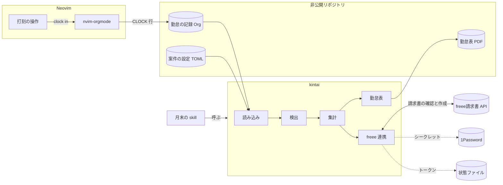
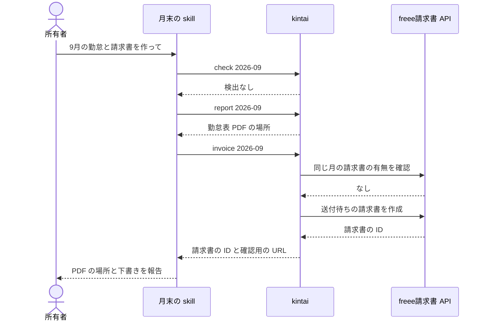

# 設計書: 勤怠表と請求書の作成

PRD 0007「勤怠表と請求書の作成」の要求を満たすために、ADR 0007 から ADR 0011 の方式をどう組むかを示す。

- 読者: 開発者、レビュー担当者、将来の保守者
- 前提の PRD: PRD 0007
- 到達している層: 層2（構成）まで。層3（コンポーネント）は未着手

この設計書は、上から読み進めるほど詳しくなる。
層1を読むと、何のために、何を前提に、どんな形で作るかが分かる。
層2まで読むと、コンポーネントがどう協調し、外からどう見えるかが分かる。
末尾には、影響とリスク、未解決点、出典をまとめる。

用語は PRD 0007 と同じ意味で使う。
案件、打刻、日ごとの見出し、勤怠表、精算幅、稼働率、基本額、日割り月、下書き、skill の意味は PRD 0007 による。
下書きは、freee請求書では送付待ちの請求書にあたる。
テンプレートの意味は ADR 0007 による。
非公開リポジトリは、PRD 0007 の展開計画で所有者が用意する、案件の設定と勤怠の記録を置くリポジトリを指す。

## 層1: 概要

### 目的

PRD 0007 の要求1から要求14を満たす構成を示す。
日々の打刻から、月末の勤怠表 PDF と freee の下書きまでを、案件ごとの精算のルールに従って作れるようにする。

### スコープとスコープ外

この設計書は、次のものを扱う。

- CLI `kintai`: 設定と記録の読み込み、検出、集計、勤怠表 PDF の生成、freee の下書きの作成、freee の認証
- 打刻の操作: Neovim の中で当日の見出しを用意し、打刻を始める
- 月末の skill: Claude Code から `kintai` を順に呼ぶ窓口
- 導入: Home Manager による、導入範囲「すべて」への組み込み

次のものは扱わない。

- PRD 0007 の対象外に挙げたこと
- 非公開リポジトリに書く、実際の案件の値
- テンプレートの見た目の細部

### 前提とする決定

| ADR | 決定 | 設計への制約 |
|---|---|---|
| ADR 0001、ADR 0004 | 開発環境と Claude Code を Nix と Home Manager で宣言的に管理する | `kintai` と skill は Home Manager で導入する |
| ADR 0006 | ノートとタスクを Org 形式で書き、nvim-orgmode で扱う | 勤怠の記録も Org 形式で書き、Neovim の中で扱う |
| ADR 0007 | `kintai` を Rust で書き、Typst を組み込んで PDF を生成する | 計算は Rust、見た目はテンプレートが担う。Org 形式は CLOCK 行とプロパティだけを正規表現で読む |
| ADR 0008 | freee の下書きは `kintai` が freee の API を呼んで作る | 金額は Claude を通さない。二重作成の確認も `kintai` が行う |
| ADR 0009 | 認証情報は、変わらない値を 1Password に、トークンを状態ファイルに置く | `kintai` が `op` で読み、トークンを自分で書き戻す |
| ADR 0010 | 案件の設定は、非公開リポジトリに案件ごとの TOML ファイルで書く | Org 形式の側から、案件の設定を指し示す手段が要る |
| ADR 0011 | 打刻は Neovim のキー操作で行い、CLOCK 行は nvim-orgmode に書かせる | `kintai` は Org 形式のファイルを読むだけで、書き込まない |

### 全体の構成

全体は、Neovim の中の打刻、非公開リポジトリに置くデータ、`kintai`、skill、外部のサービスからなる。

## 層2: 構成

### コンポーネントの責務

| コンポーネント | 受け持つこと | 受け持たないこと |
|---|---|---|
| 打刻の操作 | 案件の見出しの下に当日の見出しを用意し、すでにあればそれを使って、nvim-orgmode の clock in を呼ぶ | 時刻の丸めや集計 |
| 読み込み | 案件の設定と、日ごとの見出しの CLOCK 行とプロパティを読み、型のあるデータにする | 記録の正しさの判定 |
| 検出 | 打刻漏れと日割りの設定漏れを、対象月のすべてについて集め、まとめて報告する | 記録や設定の修正 |
| 集計 | 時刻の丸め、休憩、日ごとの稼働、月の精算を計算する | ファイルや外部のサービスとの入出力 |
| 勤怠表 | 集計結果をテンプレートに渡し、勤怠表 PDF を非公開リポジトリの決まった場所に書き出す | 見た目。見た目はテンプレートが担う |
| freee 連携 | 二重作成を確認してから、送付待ちの請求書を作る。認証とトークンの更新も受け持つ | 請求書の送付と取消 |
| 月末の skill | `kintai` を順に呼び、結果を所有者に報告する。止まったときは、直すべき箇所を案内する | 計算と金額の書き写し |

案件の見出しは、案件の設定を指すプロパティを持つ。
打刻の操作と読み込みは、このプロパティで案件の見出しを見分ける。

集計は外部の状態を持たない関数として作る。
時間は分の整数で、金額は円の整数で扱い、浮動小数点数を使わない。
1日に打刻が複数ある場合は、最初の開始を始業に、最後の終了を終業に使い、間の空白は休憩に数えない。
休憩には、PRD 0007 のとおり、案件の既定値か、日ごとの見出しに書いた例外の値を使う。

### データの流れ

通常時は、次の順に流れる。

`report` と `invoice` は、どちらも内部で必ず検出を通す。
skill が `check` を飛ばしても、検出を経ない勤怠表や下書きは作られない。

重要な失敗時は、次のように流れる。

- 打刻漏れや日割りの設定漏れがあると、`kintai` は見つけたものをすべて報告して止まる。勤怠表と下書きは作らない。skill は、報告された日付や月をもとに、直すべき箇所を所有者に案内する。
- 同じ月の請求書がすでに freee にあると、`kintai` はその請求書を示して止まる。新しい請求書は作らない。
- 案件の設定に誤りがあると、`kintai` は読み込みの時点で、誤りのある項目を示して止まる。
- freee や 1Password との通信に失敗すると、`kintai` は失敗した相手と理由を示して止まる。アクセストークンが切れていれば、リフレッシュトークンで更新してから続ける。更新もできなければ、再認証を求める。

### 外部とのインターフェース

`kintai` は、次のサブコマンドを持つ。
対象月は `YYYY-MM` の形で渡す。

| サブコマンド | 振る舞い |
|---|---|
| `kintai auth` | freee の最初の認証と再認証を行い、トークンを状態ファイルに書く |
| `kintai check <対象月>` | 検出だけを行う |
| `kintai report <対象月>` | 検出を通してから、勤怠表 PDF を生成する |
| `kintai invoice <対象月>` | 検出と二重作成の確認を通してから、送付待ちの請求書を作る |

すべてのサブコマンドは、次のオプションを受け付ける。

- `--json`: 結果を JSON で出力する。skill はこの出力を読む。
- `--project <案件ID>`: 対象の案件を指定する。同時に稼働する案件が1つの月は、省略できる。

非公開リポジトリの場所は、環境変数 `KINTAI_DIR` で渡す。

終了コードは、次のとおりとする。

| 終了コード | 意味 |
|---|---|
| 0 | 成功 |
| 1 | 検出、または同じ月の請求書があったために止まった |
| 2 | 案件の設定に誤りがある |
| 3 | freee や 1Password との通信に失敗した |

日ごとの見出しには、次のプロパティを書ける。

- 休憩の例外: その日の休憩の時間
- 備考: 勤怠表の備考の欄に載せる文

勤怠表 PDF は、非公開リポジトリの中の決まった場所に、対象月と案件が分かる名前で書き出す。
freee請求書 API には添付の手段がないため、所有者が請求書を送付するときに、この PDF を freee の画面で添付する。

### 論理データモデル

| 実体 | 主な属性 | 関係 |
|---|---|---|
| 案件 | 案件 ID、案件名、先方名、氏名、契約期間、月額、精算幅、超過単価、控除単価、丸めの単位と向き、休憩の既定値、締め日、支払期日、請求の項目、テンプレート、1Password の参照先、freee の事業所と取引先 | 月の上書きと日の記録を持つ |
| 月の上書き | 対象月、稼働率、精算幅 | 1つの案件の、契約の開始月か終了月に属する |
| 日の記録 | 日付、打刻の並び、休憩の例外、備考 | 1つの案件に属する。日ごとの見出しから読む |
| 日の勤怠 | 日付、曜日、始業、終業、休憩、稼働、備考 | 日の記録から集計する |
| 月の精算 | 対象月、合計時間、精算幅、超過または控除の時間、基本額、精算額 | 日の勤怠と、案件または月の上書きから集計する |
| 下書き | 請求日、支払期日、品目、数量、単価、税率 | 月の精算から作る。freee請求書では送付待ちの請求書になる |

請求日は、対象月の締め日とする。
同じ月の請求書があるかは、同じ取引先で、請求日が対象月の締め日にあたり、取消されていない請求書があるかで判定する。
取消した請求書は数えないため、誤って作った請求書は、freee で取消してから作り直せる。

### 非機能要求への対応

| 要求 | 対応する箇所 |
|---|---|
| 計算の正確さ | 集計を入出力から切り離した関数にし、PRD 0007 の受入条件の例を、そのまま集計のテストに使う |
| 結果の再現性 | フォントとテンプレートをバイナリに同梱し、マシンによらず同じ PDF にする |
| 誤った請求の防止 | 送付の手段を持たない。作る前に、検出と二重作成の確認を必ず通す |
| 認証情報の保護 | シークレットは 1Password から読み、トークンの状態ファイルは権限を 600 にする |
| 保守性 | 見た目はテンプレートに、計算は集計に、外部との通信は freee 連携に閉じ込め、互いの変更が波及しないようにする |

## 影響とリスク

- `typst` のクレートは API が安定していないため、版を上げると勤怠表のコンポーネントの追従が要る（層2の勤怠表）。
- freee請求書 API の変更は、freee 連携のコンポーネントで吸収する（層2の freee 連携）。
- 読み込みは nvim-orgmode が出力する CLOCK 行の書式に依存する。書式が変わると、すべての月の読み込みに影響する（層2の読み込み）。
- `kintai` は Org 形式のファイルも freee の請求書も消さないため、誤りは記録の修正と freee での取消で元に戻せる。

## 未解決点

- 使ったリフレッシュトークンが新しいものに替わるかは、freee の一次資料で確かめていない（層2の freee 連携）。どちらの場合でも、ADR 0009 の決定のとおり書き戻せば動く。
- 層3は未着手である。判断が込み入る集計と freee 連携から、実装の前に加える。

## 出典

- PRD 0007「勤怠表と請求書の作成」
- ADR 0001、ADR 0004、ADR 0006、ADR 0007、ADR 0008、ADR 0009、ADR 0010、ADR 0011
- freee請求書 API の仕様（GitHub の freee/freee-api-schema、2026-10-02 時点）: 請求書の作成と一覧、送付待ちの状態、取消、添付の手段がないこと
- freee の MCP サーバー（GitHub の freee/freee-mcp、2026-10-01 時点）: 会計 API の請求書が過去の API であること、認証の受け取り方
- 所有者へのヒアリング（2026-10-03）: 到達させる層、コマンドの形、PDF の置き場と添付、日ごとの見出しのプロパティ、複数の打刻の扱い、支払期日、二重作成の判定、請求日
