# Nix 設定ドキュメント

## 目次

1. [概要](#概要)
2. [システム構成](#システム構成)
3. [ディレクトリ構造](#ディレクトリ構造)
4. [Flake 設定](#flake-設定)
5. [Home Manager 設定](#home-manager-設定)
6. [モジュール詳細](#モジュール詳細)
   - [Git 設定](#git-設定)
   - [Zsh 設定](#zsh-設定)
   - [Neovim 設定](#neovim-設定)
   - [Node.js 環境](#nodejs-環境)
   - [Ruby 環境](#ruby-環境)
   - [Rust 環境](#rust-環境)
   - [データベースツール](#データベースツール)
   - [MCP サーバー](#mcp-サーバー)
   - [Textlint](#textlint)
7. [パッケージ管理](#パッケージ管理)
8. [よくある操作](#よくある操作)
9. [付録](#付録)

---

## 概要

このdotfilesリポジトリは、**Nix Flakes**と**Home Manager**を使用して開発環境を宣言的に管理しています。

### 主な特徴

- **宣言的構成管理**: すべての設定がコードとして定義され、再現可能
- **Flakes対応**: 依存関係のバージョンがロックされ、一貫性のあるビルドを保証
- **モジュール化**: 機能ごとに設定を分離し、保守性を向上
- **クロスプラットフォーム**: WSL、Linux環境で動作
- **開発環境統合**: Git、Zsh、Neovim、複数のプログラミング言語をサポート

### サポート環境

- **プラットフォーム**: `x86_64-linux`
- **対象OS**: WSL2 (Ubuntu)、Linux
- **Home Manager バージョン**: 24.05+
- **Nix バージョン**: 2.18+ (Flakes サポート必須)

### 技術スタック

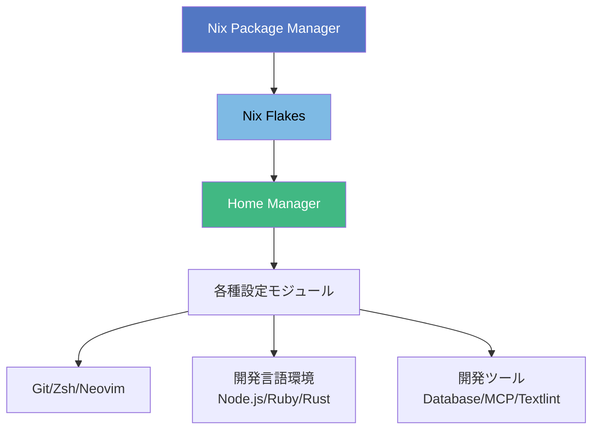

---

## システム構成

### アーキテクチャ概要

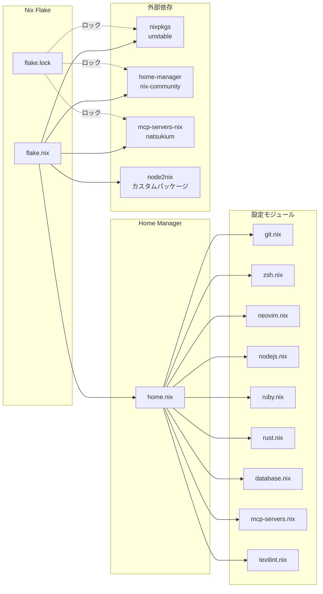

### データフロー

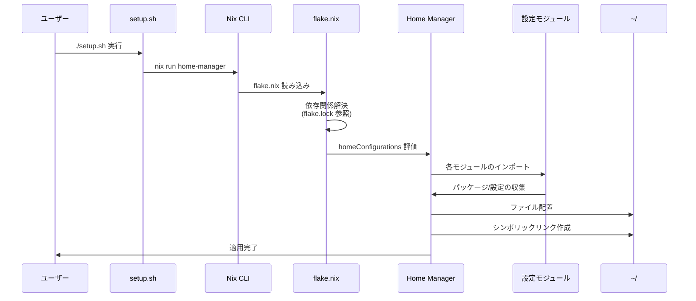

---

## ディレクトリ構造

```
dotfiles/
├── config/
│   ├── nix/                    # Nix設定のルートディレクトリ
│   │   ├── flake.nix          # Flake エントリーポイント
│   │   ├── flake.lock         # 依存関係ロックファイル
│   │   ├── home.nix           # Home Manager メイン設定
│   │   └── configs/           # モジュール化された設定
│   │       ├── git.nix        # Git 設定
│   │       ├── zsh.nix        # Zsh 設定
│   │       ├── neovim.nix     # Neovim 設定
│   │       ├── nodejs.nix     # Node.js 環境
│   │       ├── ruby.nix       # Ruby 環境
│   │       ├── rust.nix       # Rust 環境
│   │       ├── database.nix   # データベースツール
│   │       ├── mcp-servers.nix # MCP サーバー設定
│   │       └── textlint.nix   # Textlint 設定
│   │
│   ├── node2nix/              # Node.js パッケージのNix化
│   │   ├── default.nix        # エントリーポイント
│   │   ├── node-packages.nix  # パッケージ定義
│   │   └── node-env.nix       # ビルド環境
│   │
│   ├── nvim/                  # Neovim 設定ファイル
│   ├── zsh/                   # Zsh 追加設定
│   ├── sheldon/               # Sheldon プラグイン設定
│   ├── wezterm/               # Wezterm ターミナル設定
│   ├── claude/                # Claude Code スキル/エージェント
│   └── textlint/              # Textlint 設定
│
├── docs/                      # ドキュメント
│   └── nix-wiki.md           # このファイル
│
├── scripts/                   # ユーティリティスクリプト
│   ├── lint.sh               # Lintスクリプト
│   └── format.sh             # フォーマットスクリプト
│
├── setup.sh                   # 自動セットアップスクリプト
├── README.md                  # プロジェクト概要
└── result -> /nix/store/...  # Home Manager ビルド結果 (シンボリックリンク)
```

### ファイルの役割

| ファイル | 役割 |
|---------|------|
| `flake.nix` | Flakeのエントリーポイント。依存関係とHome Manager設定を定義 |
| `flake.lock` | 依存関係のバージョンをロック。再現性を保証 |
| `home.nix` | Home Managerのメイン設定。ユーザー情報、パッケージ、モジュールのインポート |
| `configs/*.nix` | 機能ごとに分割された設定モジュール |
| `node2nix/` | NPMパッケージをNixパッケージに変換 |

---

## Flake 設定

### flake.nix の構造

`flake.nix` は、このプロジェクトのエントリーポイントです。

```nix
{
  description = "Home Manager configuration";

  inputs = {
    nixpkgs.url = "github:nixos/nixpkgs?ref=nixpkgs-unstable";
    home-manager = {
      url = "github:nix-community/home-manager";
      inputs.nixpkgs.follows = "nixpkgs";
    };
    mcp-servers-nix = {
      url = "github:natsukium/mcp-servers-nix";
      inputs.nixpkgs.follows = "nixpkgs";
    };
  };

  outputs = inputs@{ self, nixpkgs, home-manager, mcp-servers-nix, ... }:
    let
      system = "x86_64-linux";
      pkgs = nixpkgs.legacyPackages.${system};
      nodePkgs = import ../node2nix/default.nix { inherit pkgs; };
    in {
      homeConfigurations = {
        mikinovation = home-manager.lib.homeManagerConfiguration {
          inherit pkgs;
          modules = [ ./home.nix ];
          extraSpecialArgs = {
            inherit nodePkgs mcp-servers-nix;
          };
        };
      };
    };
}
```

### 依存関係 (inputs)

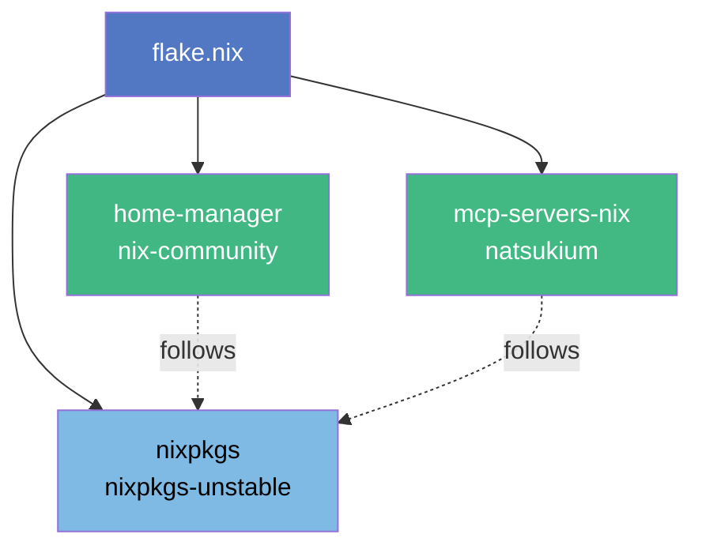

| Input | 説明 | URL | follows |
|-------|------|-----|---------|
| `nixpkgs` | Nixパッケージコレクション | `github:nixos/nixpkgs?ref=nixpkgs-unstable` | - |
| `home-manager` | ユーザー環境管理ツール | `github:nix-community/home-manager` | nixpkgs |
| `mcp-servers-nix` | MCP サーバーのNixパッケージ | `github:natsukium/mcp-servers-nix` | nixpkgs |

**follows の意味**: `follows` を使用すると、複数のinputsが同じnixpkgsバージョンを共有し、依存関係の重複を避けます。

### 出力 (outputs)

**homeConfigurations**: ユーザーごとのHome Manager設定を定義

```nix
homeConfigurations = {
  mikinovation = home-manager.lib.homeManagerConfiguration {
    inherit pkgs;
    modules = [ ./home.nix ];
    extraSpecialArgs = {
      inherit nodePkgs mcp-servers-nix;
    };
  };
};
```

- **pkgs**: nixpkgs のパッケージセット
- **modules**: Home Manager の設定モジュール（`home.nix`）
- **extraSpecialArgs**: モジュールに渡す追加引数
  - `nodePkgs`: node2nixで生成されたNode.jsパッケージ
  - `mcp-servers-nix`: MCPサーバーライブラリ

### カスタムパッケージ (node2nix)

```nix
let
  nodePkgs = import ../node2nix/default.nix { inherit pkgs; };
in
```

`node2nix` を使用して、NPMパッケージをNixパッケージに変換しています。
これにより、`@anthropic-ai/claude-code` などのNPMパッケージをNix経由でインストール可能になります。

---

## Home Manager 設定

### home.nix の構造

`home.nix` は、Home Managerのメイン設定ファイルです。

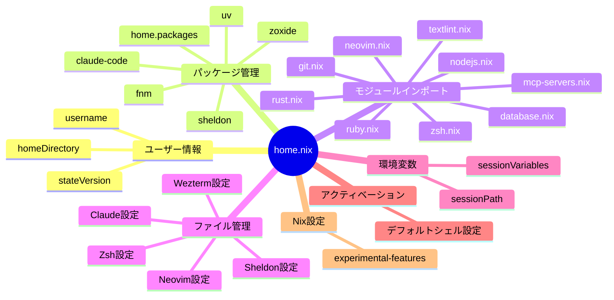

### ユーザー情報

```nix
home.username = "mikinovation";
home.homeDirectory = "/home/mikinovation";
home.stateVersion = "24.05";
```

- **username**: Home Managerが管理するユーザー名
- **homeDirectory**: ホームディレクトリのパス
- **stateVersion**: Home Managerのバージョン（**変更しない**こと）

### パッケージインストール

```nix
home.packages = with pkgs; [
  sheldon   # Zsh プラグインマネージャー
  fnm       # Fast Node Manager
  uv        # Python パッケージマネージャー
  zoxide    # スマートなcdコマンド代替
  nodePkgs."@anthropic-ai/claude-code"  # Claude Code CLI
];
```

### モジュールのインポート

```nix
imports = [
  ./configs/git.nix
  ./configs/zsh.nix
  ./configs/neovim.nix
  ./configs/nodejs.nix
  ./configs/ruby.nix
  ./configs/rust.nix
  ./configs/database.nix
  ./configs/mcp-servers.nix
  ./configs/textlint.nix
];
```

各機能を個別のNixファイルに分離することで、保守性と再利用性を向上させています。

### ファイル管理 (home.file)

```nix
home.file = {
  # Neovim 設定
  ".config/nvim".source = pkgs.lib.cleanSourceWith {
    src = ../nvim;
    filter = path: type:
      let baseName = baseNameOf path;
      in baseName != "lazy-lock.json";
  };

  # Wezterm 設定
  ".wezterm.lua".source = ../wezterm/.wezterm.lua;

  # Powerlevel10k 設定
  ".p10k.zsh".source = ../zsh/plugins/.p10k.zsh;

  # Sheldon 設定
  ".config/sheldon/plugins.toml".source = ../sheldon/plugins.toml;

  # WSL 専用設定
  "dotfiles/config/zsh/plugins/wsl.zsh".source = ../zsh/plugins/wsl.zsh;

  # Claude Code スキル
  ".claude/skills".source = ../claude/skills;

  # Claude Code エージェント
  ".claude/agents".source = ../claude/agents;
};
```

**cleanSourceWith の使用**: `lazy-lock.json` をフィルタリングすることで、データディレクトリで管理されるファイルを除外しています。

### アクティベーションスクリプト

Zshをデフォルトシェルに設定するためのスクリプトです。

```nix
home.activation.make-zsh-default-shell = config.lib.dag.entryAfter [ "writeBoundary" ] ''
  PATH="/usr/bin:/bin:$PATH"
  ZSH_PATH="${config.home.homeDirectory}/.nix-profile/bin/zsh"

  if [[ $(getent passwd ${config.home.username}) != *"$ZSH_PATH" ]]; then
    echo "Setting zsh as default shell (using chsh). Password might be necessary."

    if ! grep -q "$ZSH_PATH" /etc/shells; then
      echo "Adding zsh to /etc/shells"
      $DRY_RUN_CMD echo "$ZSH_PATH" | sudo tee -a /etc/shells
    fi

    echo "Running chsh to make zsh the default shell"
    $DRY_RUN_CMD chsh -s "$ZSH_PATH" ${config.home.username}
    echo "Zsh is now set as default shell!"
  else
    echo "Zsh is already the default shell"
  fi
'';
```

**処理フロー**:
1. Zshのパスを取得
2. `/etc/shells` に追加（未登録の場合）
3. `chsh` コマンドでデフォルトシェルを変更

### Nix 設定

```nix
nix = {
  package = pkgs.nix;
  settings = {
    experimental-features = [ "nix-command" "flakes" ];
  };
};
```

Flakesとnew-style CLIを有効化します。

---

## モジュール詳細

### Git 設定

**ファイル**: `config/nix/configs/git.nix`

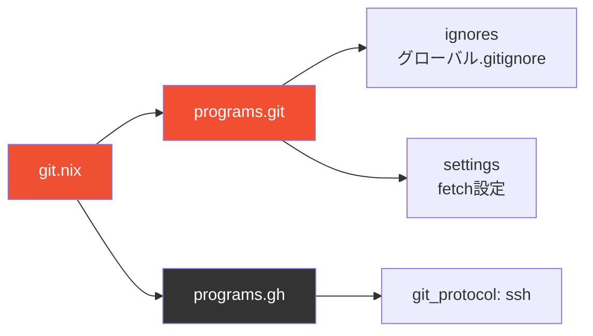

#### 設定内容

**グローバル .gitignore**

以下のファイル/ディレクトリを自動的に無視します：

- カスタムツール: `.serena/`, `m-sandbox/`
- OS固有ファイル: `.DS_Store`, `Thumbs.db`, `Desktop.ini`
- エディタ設定: `.vscode/`, `.idea/`, `*.swp`
- 開発ツール: `.direnv/`, `.envrc.local`
- 言語固有: `__pycache__/`, `node_modules/`, `*.pyc`
- ログ: `*.log`
- 環境変数: `.env.local`, `.env.*.local`

**Git 設定**

```nix
settings = {
  fetch = {
    prune = true;       # リモートで削除されたブランチをローカルでも削除
    pruneTags = true;   # 削除されたタグも削除
  };
};
```

**GitHub CLI (gh)**

```nix
programs.gh = {
  enable = true;
  settings = {
    git_protocol = "ssh";  # SSH プロトコルを使用
  };
};
```

---

### Zsh 設定

**ファイル**: `config/nix/configs/zsh.nix`

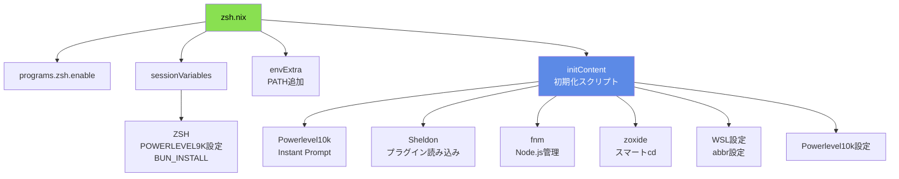

#### 環境変数

```nix
sessionVariables = {
  ZSH = "$HOME/.local/share/sheldon/repos/github.com/ohmyzsh/ohmyzsh";
  BUN_INSTALL = "$HOME/.bun";
  POWERLEVEL9K_DISABLE_CONFIGURATION_WIZARD = "true";
};
```

#### PATH 追加

```nix
envExtra = ''
  export PATH="$HOME/.local/bin:$PATH"
  export PATH="$PATH:/opt/nvim/"
  export PATH="/home/linuxbrew/.linuxbrew/bin:$PATH"
  export PATH="$BUN_INSTALL/bin:$PATH"
'';
```

#### 初期化スクリプト

```nix
initContent = ''
  # Powerlevel10k Instant Prompt
  if [[ -r "''${XDG_CACHE_HOME:-$HOME/.cache}/p10k-instant-prompt-''${(%):-%n}.zsh" ]]; then
    source "''${XDG_CACHE_HOME:-$HOME/.cache}/p10k-instant-prompt-''${(%):-%n}.zsh"
  fi

  # Sheldon プラグイン読み込み
  eval "$(sheldon source)"

  # fnm 設定
  FNM_PATH="$HOME/.local/share/fnm"
  if [ -d "$FNM_PATH" ]; then
    export PATH="$FNM_PATH:$PATH"
    eval "`fnm env`"
  fi
  eval "$(fnm env --use-on-cd --shell zsh)"

  # zoxide 設定
  eval "$(zoxide init zsh --cmd cd)"

  # WSL 固有設定
  [[ -f ~/dotfiles/config/zsh/plugins/wsl.zsh ]] && source ~/dotfiles/config/zsh/plugins/wsl.zsh

  # Zsh abbreviations
  [[ -f ~/dotfiles/config/zsh/plugins/abbr.zsh ]] && source ~/dotfiles/config/zsh/plugins/abbr.zsh

  # Powerlevel10k 設定
  [[ ! -f ~/.p10k.zsh ]] || source ~/.p10k.zsh

  # bun completions
  [ -s "/home/mikinovation/.bun/_bun" ] && source "/home/mikinovation/.bun/_bun"
'';
```

#### 統合ツール

| ツール | 用途 | 初期化コマンド |
|-------|------|--------------|
| **Powerlevel10k** | 高速でカスタマイズ可能なZshテーマ | Instant Prompt |
| **Sheldon** | Zsh プラグインマネージャー | `eval "$(sheldon source)"` |
| **fnm** | 高速なNode.jsバージョン管理 | `fnm env --use-on-cd` |
| **zoxide** | スマートなディレクトリジャンプ | `zoxide init zsh --cmd cd` |
| **bun** | 高速なJavaScript/TypeScriptランタイム | Completions読み込み |

---

### Neovim 設定

**ファイル**: `config/nix/configs/neovim.nix`

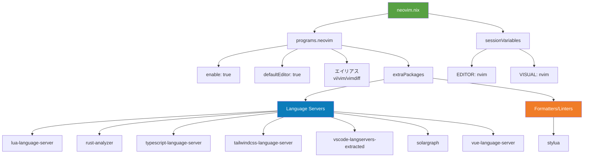

#### 基本設定

```nix
programs.neovim = {
  enable = true;
  defaultEditor = true;  # システムのデフォルトエディタに設定
  viAlias = true;        # vi コマンドでneovimを起動
  vimAlias = true;       # vim コマンドでneovimを起動
  vimdiffAlias = true;   # vimdiff コマンドでneovimを起動
};
```

#### インストールされるツール

**Language Servers (LSP)**

| LSP | 言語/技術 |
|-----|----------|
| `lua-language-server` | Lua |
| `rust-analyzer` | Rust |
| `typescript-language-server` | TypeScript/JavaScript |
| `tailwindcss-language-server` | Tailwind CSS |
| `vscode-langservers-extracted` | HTML, CSS, JSON, ESLint |
| `solargraph` | Ruby |
| `vue-language-server` (volar) | Vue.js |

**Formatters & Linters**

| ツール | 用途 |
|-------|------|
| `stylua` | Lua フォーマッター |

#### 環境変数

```nix
home.sessionVariables = {
  EDITOR = "nvim";
  VISUAL = "nvim";
};
```

これにより、Gitなどのツールがneovimをデフォルトエディタとして使用します。

#### Neovim 設定ファイル

実際のNeovim設定は `config/nvim/` ディレクトリに配置され、`home.nix` の `home.file` セクションでシンボリックリンクされます：

```nix
".config/nvim".source = pkgs.lib.cleanSourceWith {
  src = ../nvim;
  filter = path: type:
    let baseName = baseNameOf path;
    in baseName != "lazy-lock.json";
};
```

---

### Node.js 環境

**ファイル**: `config/nix/configs/nodejs.nix`

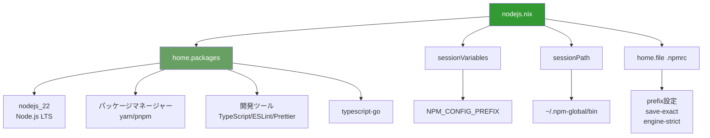

#### インストールされるパッケージ

```nix
home.packages = with pkgs; [
  nodejs_22                         # Node.js LTS (v22)
  yarn                              # Yarn パッケージマネージャー
  nodePackages.pnpm                 # pnpm パッケージマネージャー
  nodePackages.typescript           # TypeScript コンパイラ
  nodePackages.typescript-language-server  # TypeScript LSP
  nodePackages.eslint               # ESLint リンター
  nodePackages.prettier             # Prettier フォーマッター
  typescript-go                     # Go実装のTypeScript
];
```

#### 環境変数設定

```nix
home.sessionVariables = {
  NPM_CONFIG_PREFIX = "${config.home.homeDirectory}/.npm-global";
};

home.sessionPath = [
  "${config.home.homeDirectory}/.npm-global/bin"
];
```

グローバルNPMパッケージを `~/.npm-global` にインストールします。

#### .npmrc 設定

```nix
home.file.".npmrc".text = ''
  prefix=''${HOME}/.npm-global
  save-exact=true      # 完全なバージョン番号で保存
  engine-strict=true   # engineフィールドを厳密にチェック
'';
```

---

### Ruby 環境

**ファイル**: `config/nix/configs/ruby.nix`

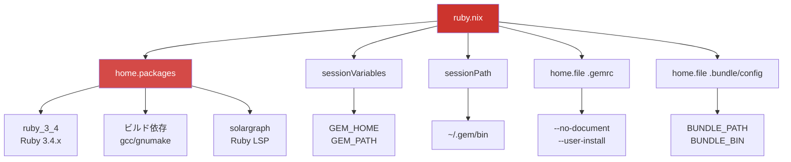

#### インストールされるパッケージ

```nix
home.packages = with pkgs; [
  ruby_3_4                    # Ruby 3.4.x
  gcc                         # C/C++ コンパイラ (ネイティブ拡張用)
  gnumake                     # Make (ビルド用)
  rubyPackages.solargraph     # Ruby Language Server
];
```

#### 環境変数設定

```nix
home.sessionVariables = {
  GEM_HOME = "${config.home.homeDirectory}/.gem";
  GEM_PATH = "${config.home.homeDirectory}/.gem";
};

home.sessionPath = [
  "${config.home.homeDirectory}/.gem/bin"
];
```

Gemを `~/.gem` にインストールします。

#### .gemrc 設定

```nix
home.file.".gemrc".text = ''
  gem: --no-document      # ドキュメント生成をスキップ
  install: --user-install # ユーザーディレクトリにインストール
  update: --user-install
'';
```

#### Bundler 設定

```nix
home.file.".bundle/config".text = ''
  ---
  BUNDLE_PATH: ".bundle/vendor"  # プロジェクトローカルにインストール
  BUNDLE_BIN: ".bundle/bin"      # binディレクトリの場所
'';
```

---

### Rust 環境

**ファイル**: `config/nix/configs/rust.nix`

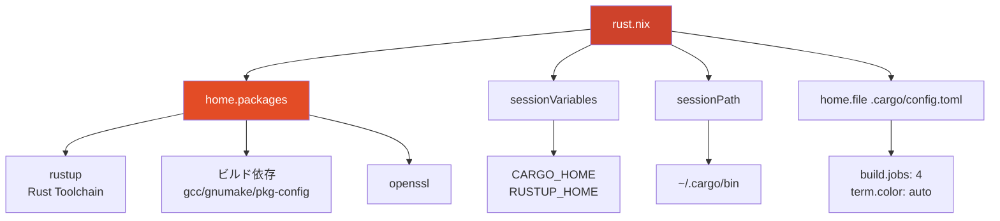

#### インストールされるパッケージ

```nix
home.packages = with pkgs; [
  rustup         # Rust ツールチェーン管理 (rustc, cargo, rust-analyzer, rustfmt, clippy含む)
  gcc            # C/C++ コンパイラ
  gnumake        # Make
  pkg-config     # パッケージ設定ツール
  openssl        # OpenSSL ライブラリ
];
```

**rustup に含まれるツール**:
- `rustc`: Rust コンパイラ
- `cargo`: Rust パッケージマネージャー
- `rust-analyzer`: Rust LSP
- `rustfmt`: Rust フォーマッター
- `clippy`: Rust リンター

#### 環境変数設定

```nix
home.sessionVariables = {
  CARGO_HOME = "${config.home.homeDirectory}/.cargo";
  RUSTUP_HOME = "${config.home.homeDirectory}/.rustup";
};

home.sessionPath = [
  "${config.home.homeDirectory}/.cargo/bin"
];
```

#### Cargo 設定

```nix
home.file.".cargo/config.toml".text = ''
  [build]
  jobs = 4        # 並列ビルドジョブ数

  [term]
  color = "auto"  # 自動カラー出力
'';
```

---

### データベースツール

**ファイル**: `config/nix/configs/database.nix`

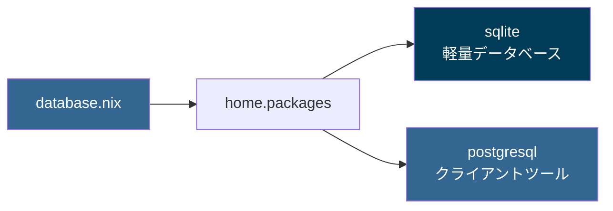

#### インストールされるパッケージ

```nix
home.packages = with pkgs; [
  sqlite       # SQLite データベース
  postgresql   # PostgreSQL クライアントツール (psql, pg_dump など)
];
```

---

### MCP サーバー

**ファイル**: `config/nix/configs/mcp-servers.nix`

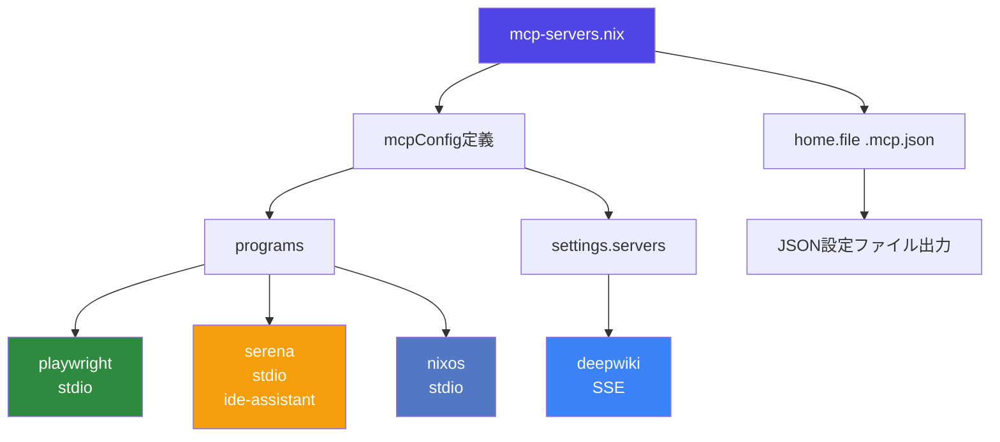

#### 設定内容

MCP (Model Context Protocol) サーバーは、Claude Code と連携して動作するツールです。

```nix
let
  mcpConfig = mcp-servers-nix.lib.mkConfig pkgs {
    programs = {
      # Playwright MCP Server (stdio 接続)
      playwright = {
        enable = true;
      };

      # Serena MCP Server (stdio 接続)
      serena = {
        enable = true;
        context = "ide-assistant";
      };

      # NixOS MCP Server (stdio 接続)
      nixos = {
        enable = true;
      };
    };

    # カスタムサーバー (モジュール未対応)
    settings.servers = {
      # DeepWiki MCP Server (SSE 接続)
      deepwiki = {
        type = "sse";
        url = "https://mcp.deepwiki.com/sse";
      };
    };
  };
in
{
  home.file.".mcp.json".text = builtins.readFile "${mcpConfig}";
}
```

#### MCP サーバー一覧

| サーバー | タイプ | 用途 |
|---------|-------|------|
| **playwright** | stdio | ブラウザ自動化、E2Eテスト |
| **serena** | stdio | IDE統合アシスタント |
| **nixos** | stdio | NixOSパッケージ/オプション情報 |
| **deepwiki** | SSE | Wikiドキュメント検索 |

#### 接続タイプ

- **stdio**: 標準入出力を使用した通信
- **SSE**: Server-Sent Events (HTTP ストリーミング)

#### 生成される設定ファイル

`~/.mcp.json` に設定がJSON形式で出力されます。Claude Code がこのファイルを読み込んで各MCPサーバーと連携します。

---

### Textlint

**ファイル**: `config/nix/configs/textlint.nix`

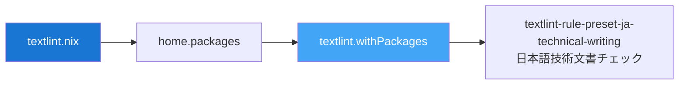

#### インストールされるパッケージ

```nix
home.packages = with pkgs; [
  (textlint.withPackages [
    textlint-rule-preset-ja-technical-writing  # 日本語技術文書用ルールセット
  ])
];
```

---

## パッケージ管理

### パッケージ追加フロー

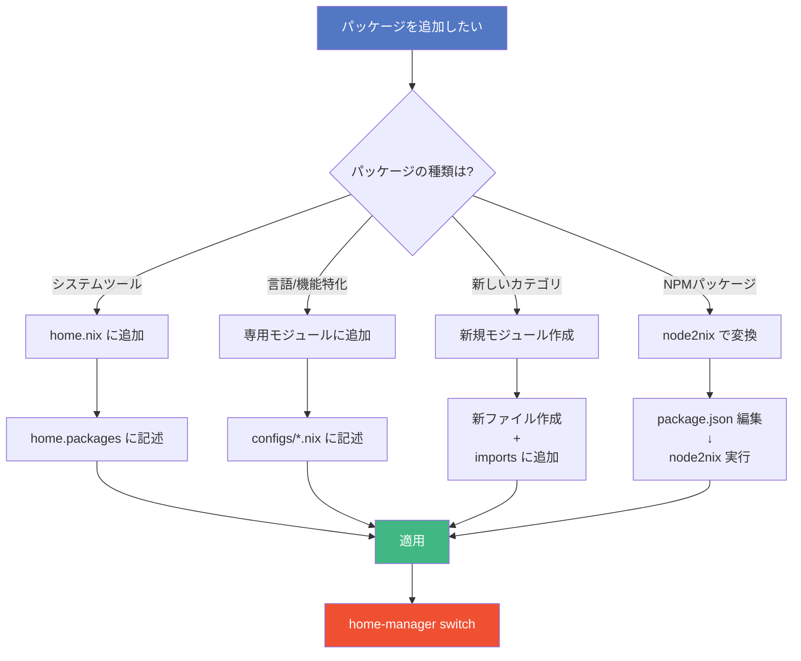

### パッケージ検索

| 方法 | コマンド/URL |
|-----|-------------|
| **CLI検索** | `nix search nixpkgs <package-name>` |
| **Web検索** | https://search.nixos.org/packages |
| **バージョン確認** | `nix-env -q` |

---

## よくある操作

### 基本コマンド

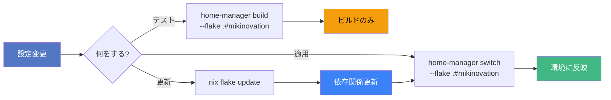

### コマンド一覧

| 操作 | コマンド |
|-----|---------|
| **設定適用** | `./setup.sh` または `home-manager switch --flake .#mikinovation` |
| **ビルドのみ** | `home-manager build --flake .#mikinovation` |
| **依存更新** | `nix flake update` |
| **特定入力更新** | `nix flake lock --update-input nixpkgs` |
| **世代確認** | `home-manager generations` |
| **GC実行** | `nix-collect-garbage -d` |
| **環境変数確認** | `cat ~/.nix-profile/etc/profile.d/hm-session-vars.sh` |

---

## 付録

### 参考リンク

- **Nix 公式ドキュメント**: https://nixos.org/manual/nix/stable/
- **Nixpkgs マニュアル**: https://nixos.org/manual/nixpkgs/stable/
- **Home Manager マニュアル**: https://nix-community.github.io/home-manager/
- **Nix Flakes**: https://nixos.wiki/wiki/Flakes
- **mcp-servers-nix**: https://github.com/natsukium/mcp-servers-nix
- **node2nix**: https://github.com/svanderburg/node2nix

### 用語集

| 用語 | 説明 |
|------|------|
| **Nix** | 関数型パッケージマネージャー |
| **nixpkgs** | Nixパッケージコレクション |
| **Flakes** | 再現可能なビルドを実現するNixの機能 |
| **Home Manager** | Nix でユーザー環境を管理するツール |
| **derivation** | Nixでパッケージをビルドするための設定 |
| **store path** | `/nix/store` 内のパッケージのパス |
| **generation** | Home Manager の世代（スナップショット） |
| **profile** | ユーザー環境のシンボリックリンク |

---

## まとめ

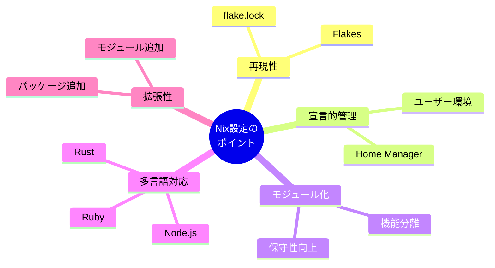
