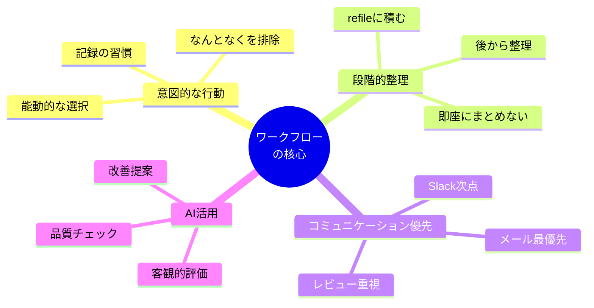

# 開発ワークフローガイド

## 目次

1. [概要](#概要)
2. [ワークフローの全体像](#ワークフローの全体像)
3. [タスク管理の基本](#タスク管理の基本)
4. [毎日のルーティン](#毎日のルーティン)
5. [コミュニケーション運用](#コミュニケーション運用)
   - [Slack運用フロー](#slack運用フロー)
   - [メール運用フロー](#メール運用フロー)
6. [プロジェクト管理ツール運用](#プロジェクト管理ツール運用)
7. [ミーティング運用](#ミーティング運用)
   - [朝会運用フロー](#朝会運用フロー)
   - [ミーティング前ワークフロー](#ミーティング前ワークフロー)
   - [ミーティング後ワークフロー](#ミーティング後ワークフロー)
8. [開発運用](#開発運用)
   - [プルリク作成ワークフロー](#プルリク作成ワークフロー)
   - [プルリクレビューワークフロー](#プルリクレビューワークフロー)
   - [QAテストケース作成ワークフロー](#qaテストケース作成ワークフロー)
9. [ふりかえり運用フロー](#ふりかえり運用フロー)
10. [まとめ](#まとめ)

---

## 概要

このドキュメントは、効率的な開発ワークフローを実現するための実践的なガイドです。

> **⚠️ 重要な注意事項**
>
> このワークフローは、筆者が個人的に実践している方法をまとめたものです。
> 万人に適した方法ではなく、あくまで一つの参考例として捉えてください。
>
> - 個人の作業スタイルや環境に応じて大きく異なります
> - 普段からタスク管理やコミュニケーションを円滑に行う能力のある方には適さない可能性があります
> - チームやプロジェクトの方針によっては適さない場合があります
> - 自分に合った方法を見つけることが最も重要です
>
> このドキュメントから有用な部分を取り入れ、自分なりのワークフローを構築することをお勧めします。

### 主な特徴

- **nvim-orgmode による管理**: Emacs org-mode 互換のタスク管理システム
- **段階的な整理**: 気づいたタスクはrefileに積み、後から整理
- **AIエージェント活用**: コミュニケーション内容の品質チェック
- **意図的な行動**: なんとなくの作業を排除し、すべての行動を記録
- **優先度の明確化**: コミュニケーション優先のタスク管理

### ワークフローの哲学

- 作業ワークフロー
 - nvim-orgmodeで管理
  - いきなりまとめない。気づいたらrefileに積み、後から整理
 - 毎日やることのTODO
   1. メールの確認
   2. Slackを開く
   2. 業務開始の日報投稿
   3. 朝会
   4. Slackごとの返信TODO
   5. 翌日朝会で話すことのまとめ
   6. 業務終了時日報
- タスクの優先度
  - 1. メールの返信
  - 2. Slackの返信
  - 3. レビュー等のコミュニケーションを要するもの
  - 4. 残りは各チケットの優先度に従う
- Slack運用フロー
  - ブラウザを使用。原則アプリは使わない
  - 常に能動的に開くため、開くときには常に記録する。なんとなくで見に行かない
  - スレッドごとにTODOを作る
  - いきなり返信しない。相手の役割に相当するAIエージェントに返信内容を評価してもらう
- Notion, Jira, Backlog等のプロジェクト管理ツール運用フロー
  - TODOチケット運用フロー
    - 「対応中」ステータスにする。「レビュー中」ステータスにする。という単位でTODOを作る
  - ドキュメント作成運用フロー
- 朝会運用フロー
  - 前日までに話すことをまとめる
  - まとめたらPMもしくは、エンジニアリングマネージャー相当のAIエージェントに内容を評価してもらう
- QAテストケース作成ワークフロー
  - Githubのテストケースを作成
- ミーティング前ワークフロー
  - 議題があれば箇条書きでまとめる
  - AIでPM、もしくはエンジニアリングマネージャー相当のAIエージェントに内容を評価してもらう
- ミーティング後ワークフロー
  - 議事録を箇条書きで書く
  - AIでPM、もしくはエンジニアリングマネージャー相当のAIエージェントに内容を評価してもらう
- プルリク作成ワークフロー
- プルリクレビューワークフロー
- ふりかえり(レトロスペクティブ)運用フロー

このワークフローは、効率的な開発と高品質なアウトプットを両立するための実践的なガイドです。
各自の状況に合わせてカスタマイズし、継続的に改善していくことが重要です。
